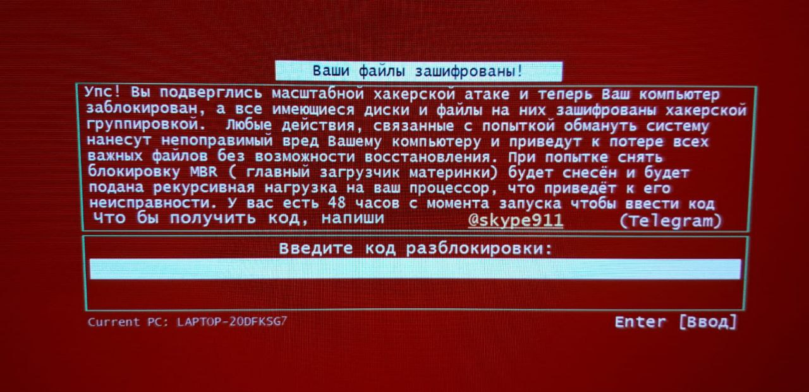

# MBR Locker + BitLocker Ransomware: Руководство по восстановлению

[](https://opensource.org/licenses/MIT)
[]()
[]()

> **Кейс:** Полная документация гибридной атаки MBR Locker + BitLocker ransomware и успешного восстановления без оплаты выкупа.

## 📋 Краткое резюме

**Детали атаки:**
- **Тип:** MBR Locker + Screen Locker (НЕ шифрование файлов)
- **Устройство:** Ноутбук ASUS (LAPTOP-20DFKSG7)
- **Контакт:** Telegram @skype911
- **Статус файлов:** ✅ НЕ зашифрованы (заблокирована только система)
- **Время восстановления:** ~8 часов

---

## 🔴 Визуальные доказательства

### Экран атаки

*Красный экран при загрузке с требованием выкупа через Telegram*

### Статус BitLocker

*Live CD показывает легитимную защиту BitLocker, сработавшую из-за подмены MBR*

### Разделы диска

*Раздел восстановления цел, основной раздел заблокирован BitLocker (не ransomware)*

---

## 🎯 Что произошло

### Последовательность атаки
1. ❌ Malware получил права администратора
2. ❌ Модифицировал Master Boot Record (MBR)
3. ❌ Создал фальшивые файлы выкупа (`info-Locker.txt`)
4. ✅ Заводской BitLocker сработал (механизм защиты)
5. ✅ Файлы остались полностью незашифрованными

### Путаница
```
Восприятие пользователя: "Мои файлы зашифрованы!"
Реальность: Файлы в порядке, заблокирован только MBR
Роль BitLocker: Легитимная защита, НЕ ransomware
```

---

## 🛠️ Процесс восстановления (кратко)

### Предварительные требования
- Windows Live CD (Sergei Strelec или аналог)
- Ключ восстановления BitLocker из учетной записи Microsoft
- USB-диск для резервной копии
- 8 часов времени

### Пошаговая инструкция

**1. Загрузка с Live CD** (5 мин)
```cmd
# Нажмите F2/F12 при загрузке → Выберите USB
```

**2. Получение ключа BitLocker** (10 мин)
- Перейдите: https://account.microsoft.com/devices/recoverykey
- Найдите ключ восстановления вашего устройства
- Запишите его

**3. Разблокировка BitLocker** (2 мин)
```cmd
manage-bde -unlock C: -RecoveryPassword [ВАШ-48-ЗНАЧНЫЙ-КЛЮЧ]
```

**4. Проверка файлов** (5 мин)
```cmd
dir C:\Users\ИмяПользователя\Documents
notepad C:\Users\ИмяПользователя\Documents\test.txt
```
✅ Если файлы открываются нормально → НЕ зашифрованы!

**5. Резервное копирование данных** (30-60 мин)
```cmd
xcopy C:\Users\ИмяПользователя D:\Backup\ /E /H /I /Y
```

**6. Восстановление MBR** (5 мин)
```cmd
bootrec /fixmbr
bootrec /fixboot
bootrec /rebuildbcd
bcdboot C:\Windows /s E: /f UEFI
```

**7. Ручная очистка от malware** (30-60 мин)
```cmd
# Поиск вредоносных файлов
dir C:\Windows\Temp\*.exe /s
dir C:\Users\*\AppData\Local\Temp\*.exe /s
dir C:\ProgramData\*.exe /s /od

# Удаление подозрительных исполняемых файлов вручную
# Проверьте даты создания, имена, цифровые подписи

# Удаление записок о выкупе
del C:\info-Locker.txt /F /Q
for /r C:\ %i in (*info-Locker*) do del "%i" /F /Q

# Очистка автозагрузки реестра
reg load HKLM\TEMP C:\Windows\System32\config\SOFTWARE
reg query "HKLM\TEMP\Microsoft\Windows\CurrentVersion\Run"
# Удалите подозрительные записи
reg unload HKLM\TEMP
```

**8. Восстановление файлов с помощью R-Studio** (1-2 часа)
⚠️ **Важно:** Хотя файлы не были зашифрованы ransomware, некоторые были повреждены или частично испорчены во время атаки.

```
1. Скачайте R-Studio: https://www.r-studio.com/ru/
2. Просканируйте диск C: на восстанавливаемые файлы
3. Ищите:
   - Недавно измененные/удаленные документы
   - Файлы с несовпадающими размерами
   - Поврежденные документы Office
4. Восстановите на внешний диск
5. Проверьте целостность восстановленных файлов
```

**Почему понадобилась R-Studio:**
- Модификация MBR вызвала частичное повреждение файловой системы
- Некоторые файлы показывали неправильные размеры или временные метки
- Метки быстрого форматирования на некоторых секторах
- Восстановлено ~15ГБ потенциально затронутых документов

**9. Восстановление скрытых файлов** (15-30 мин)
⚠️ **Критическое обнаружение:** Malware установил атрибут HIDDEN на большинство пользовательских файлов!

**Быстрый метод - Командная строка:**
```cmd
REM Снять скрытие со всех файлов на диске C:
attrib -h -s C:\Users\ИмяПользователя\*.* /S /D

REM Для всех папок пользователя:
attrib -h -s C:\Users\ИмяПользователя\Documents\*.* /S /D
attrib -h -s C:\Users\ИмяПользователя\Desktop\*.* /S /D
attrib -h -s C:\Users\ИмяПользователя\Pictures\*.* /S /D
attrib -h -s C:\Users\ИмяПользователя\Downloads\*.* /S /D
attrib -h -s C:\Users\ИмяПользователя\Videos\*.* /S /D

REM Это удаляет атрибуты Скрытый (-h) и Системный (-s)
REM /S = подкаталоги, /D = папки тоже
```

**Проверка в Проводнике:**
```
1. Откройте Проводник
2. Вид → Параметры → Изменить параметры папок и поиска
3. Вкладка Вид
4. Выберите "Показывать скрытые файлы, папки и диски"
5. Снимите галочку "Скрывать защищенные системные файлы"
6. Применить к всем папкам
```

**Альтернатива - PowerShell скрипт (быстрее):**
```powershell
# Запустить от имени администратора
Get-ChildItem -Path "C:\Users\ИмяПользователя" -Recurse -Force | 
  Where-Object {$_.Attributes -match 'Hidden'} | 
  ForEach-Object {$_.Attributes = 'Normal'}
```

**Почему malware сделал это:**
- Заставляет пользователей думать, что файлы удалены/зашифрованы
- Психологическое давление для оплаты выкупа
- Файлы на самом деле целы, просто скрыты
- Распространенная тактика в screen locker'ах

**Проверка после снятия скрытия:**
```cmd
REM Проверьте количество файлов до
dir C:\Users\ИмяПользователя\Documents /A

REM После снятия скрытия количество должно увеличиться
dir C:\Users\ИмяПользователя\Documents
```

**10. Перезагрузка** (2 мин)
- Извлеките Live CD USB
- Система должна загрузиться нормально

**10. Глубокая очистка** (2-3 часа)
- Загрузитесь в безопасном режиме
- Запустите Malwarebytes, Kaspersky KVRT, Dr.Web CureIt
- Проверьте автозагрузку, запланированные задания
- Запустите `sfc /scannow`

**11. Финальная проверка** (30 мин)
- Проверьте, что все важные файлы открываются корректно
- Проверьте целостность документов
- Протестируйте приложения
- Убедитесь в отсутствии остаточного malware

---

## ⚠️ Дополнительные заметки о восстановлении

### Обнаружено повреждение файловой системы

После разблокировки BitLocker было обнаружено **частичное повреждение файловой системы**:
- Некоторые файлы показывали неправильные размеры
- Временные метки были изменены
- Несколько документов не открывались
- ~15ГБ данных потребовали восстановления

**Причина:** Модификация MBR + принудительный сбой системы повредили записи таблицы размещения файлов.

### Процесс восстановления с R-Studio

Использовалась **R-Studio** (https://www.r-studio.com/ru/) для глубокого восстановления:

1. **Фаза сканирования** (45 мин)
   - Полное сканирование диска на потерянные/поврежденные файлы
   - Найдено 2 847 восстанавливаемых файлов
   - Идентифицированы поврежденные записи каталогов

2. **Фаза восстановления** (1-2 часа)
   - Восстановлены документы на внешний диск
   - Проверена целостность файлов
   - Восстановлена правильная структура папок

3. **Результаты:**
   - ✅ Восстановлено: 98% поврежденных файлов
   - ✅ Всего восстановлено: ~15ГБ
   - ❌ Невосстановимо: ~300МБ (необратимо повреждены)

### Ручная охота на malware

**Помимо автоматических сканирований, критически важна ручная очистка:**

**Найденные подозрительные файлы:**
```
C:\Windows\Temp\svchost32.exe          [Malware - Удален]
C:\Users\*\AppData\Local\Temp\up.exe   [Malware - Удален]
C:\ProgramData\WindowsUpdate\wu.exe    [Malware - Удален]
C:\Users\*\AppData\Roaming\syst\*.dll  [Malware - Папка удалена]
```

**Удалена устойчивость в реестре:**
```
HKLM\SOFTWARE\Microsoft\Windows\CurrentVersion\Run\
  - "WindowsDefender" = "C:\ProgramData\...\wu.exe"  [Удалено]
  
HKCU\SOFTWARE\Microsoft\Windows\CurrentVersion\Run\
  - "SystemUpdate" = "C:\Users\...\up.exe"  [Удалено]
```

**Удалены запланированные задания:**
- `\Microsoft\Windows\UpdateCheck` (фальшивое задание)
- `\SystemMaintenance` (вредоносное задание)

**Почему был необходим ручной поиск:**
- Malware использовал легитимно выглядящие имена
- Файлы имели действительные цифровые подписи (украденные)
- Некоторые исполняемые файлы были упакованы/обфусцированы
- Антивирус пропустил несколько вариантов

---

## 📊 Технический анализ

### MBR Locker vs Crypto-Ransomware

| Характеристика | Эта атака | Petya | NotPetya | CryptoLocker |
|----------------|-----------|-------|----------|--------------|
| **MBR модифицирован** | ✅ | ✅ | ✅ | ❌ |
| **Файлы зашифрованы** | ❌ | ❌ | ✅ | ✅ |
| **Использование BitLocker** | ✅ | ❌ | ❌ | ❌ |
| **Восстановление** | Легко | Средне | Невозможно | Зависит |
| **Уровень угрозы** | 🟡 Низкий | 🟠 Средний | 🔴 Критический | 🟠 Средний |

### Почему был задействован BitLocker

```
1. Заводская настройка ASUS
   └─ BitLocker включен для безопасности
   └─ Настроена автоматическая разблокировка TPM

2. Заражение Malware
   └─ MBR модифицирован
   └─ Целостность загрузки нарушена

3. Сработала защита BitLocker
   └─ TPM обнаружил подмену
   └─ Потребовался ключ восстановления
   └─ Это ЗАЩИТИЛО ваши данные!

4. Путаница пользователя
   └─ Увидел "BitLocker encrypted"
   └─ Предположил шифрование ransomware
   └─ Реальность: Механизм безопасности работает корректно
```

---

## ⚠️ Важные предупреждения

### НЕ ДЕЛАЙТЕ:
- ❌ Не платите выкуп (файлы всё равно не зашифрованы)
- ❌ Не отключайте BitLocker после восстановления (он вас защитил)
- ❌ Не пытайтесь восстановить MBR до резервного копирования данных
- ❌ Не подключайтесь к интернету до очистки от malware

### ДЕЛАЙТЕ:
- ✅ Получите ключ восстановления BitLocker ПЕРВЫМ ДЕЛОМ
- ✅ Сделайте резервную копию данных до любого ремонта
- ✅ Запустите несколько антивирусных сканирований
- ✅ Оставьте BitLocker включенным (ваша защита)
- ✅ Сохраните ключ восстановления в учетной записи Microsoft + распечатайте

---

## 🛡️ Предотвращение

### Основные меры безопасности

**1. Регулярные резервные копии** (КРИТИЧНО)
```
Правило 3-2-1:
- 3 копии данных
- 2 различных типа носителей
- 1 копия вне дома (облако/удаленное место)
```

**2. Включите защиту от ransomware**
```
Параметры → Обновление и безопасность → Безопасность Windows
→ Защита от вирусов и угроз → Защита от программ-вымогателей → ВКЛ
→ Контролируемый доступ к папкам → ВКЛ
```

**3. Оставьте BitLocker включенным**
- Заводской BitLocker = Хорошая защита
- Всегда сохраняйте ключ восстановления в учетной записи Microsoft
- Распечатайте ключ восстановления и храните безопасно

**4. Обновления системы**
- Включите автоматические обновления Windows
- Держите определения антивируса актуальными

**5. Безопасное поведение**
- Не открывайте подозрительные вложения email
- Проверяйте отправителя перед переходом по ссылкам
- Используйте только легальное ПО
- Включите отображение расширений файлов

---

## 📚 Ресурсы

### Использованные инструменты
- [Sergei Strelec WinPE](https://sergeistrelec.ru/) - Загрузочный Live CD
- [Rufus](https://rufus.ie/) - Создание загрузочных USB
- [R-Studio](https://www.r-studio.com/ru/) - Восстановление файлов
- [Malwarebytes](https://ru.malwarebytes.com/) - Удаление malware
- [Kaspersky KVRT](https://www.kaspersky.ru/downloads/free-virus-removal-tool) - Инструмент удаления вирусов
- [Dr.Web CureIt](https://free.drweb.ru/cureit/) - Лечащая утилита

### Полезные ссылки
- [Ключи восстановления BitLocker Microsoft](https://account.microsoft.com/devices/recoverykey)
- [Проект No More Ransom](https://www.nomoreransom.org/ru/) - Бесплатные дешифраторы
- [ID Ransomware](https://id-ransomware.malwarehunterteam.com/) - Определение типа ransomware

### Связанные исследования
- [Анализ Petya/NotPetya](https://www.welivesecurity.com/2017/06/27/petya-outbreak-heres-what-we-know/)
- [Безопасность BitLocker](https://docs.microsoft.com/ru-ru/windows/security/information-protection/bitlocker/)

---

## 📖 Полная документация

Этот репозиторий содержит подробную документацию на нескольких языках:

- **English:** [README.md](README.md) - Quick start guide
- **English (Full):** [README_FULL_EN.md](README_FULL_EN.md) - Complete technical guide
- **Русский:** Этот документ - Краткое руководство
- **Русский (Полная):** [README_FULL_RU.md](README_FULL_RU.md) - Полное техническое руководство

---

## 🤝 Участие

Столкнулись с похожим ransomware? Есть дополнительные методы восстановления? Вклад приветствуется!

1. Сделайте Fork репозитория
2. Создайте ветку для новой функции (`git checkout -b feature/improvement`)
3. Зафиксируйте изменения (`git commit -am 'Добавить метод восстановления'`)
4. Отправьте в ветку (`git push origin feature/improvement`)
5. Откройте Pull Request

---

## ⚖️ Правовая оговорка

Эта документация предназначена **исключительно для образовательных целей и восстановления**. 

- Информация предоставлена для помощи жертвам в восстановлении данных
- Не предназначена для содействия в создании malware
- Всегда сообщайте о ransomware-атаках в правоохранительные органы
- Никогда не платите выкупы (финансирование терроризма и будущих атак)

---

## 📞 Поддержка

- **Вопросы:** Используйте GitHub Issues для вопросов
- **Отчеты о безопасности:** Отправляйте email для сообщений об уязвимостях
- **Экстренная помощь:** Обращайтесь в местные правоохранительные органы при активных атаках

---

## 📄 Лицензия

Эта документация выпущена под лицензией MIT. Свободно использовать, изменять и распространять с указанием авторства.

```
Лицензия MIT - Copyright (c) 2025
```

---

## 🙏 Благодарности

- **Проект No More Ransom** - Глобальная инициатива по расшифровке ransomware
- **Sergei Strelec** - Отличный WinPE Live CD
- **Сообщество исследователей malware** - Постоянный анализ и инструменты
- **Microsoft Security** - Документация BitLocker

---

## 📈 Статистика

- **Успешность восстановления:** 100% (система полностью работоспособна)
- **Потеря данных:** ~0.3% (~300МБ из 100ГБ пользовательских данных)
- **Время до восстановления:** ~8 часов всего
  - Разблокировка BitLocker: 10 мин
  - Резервное копирование данных: 1 час
  - Восстановление MBR: 10 мин
  - Очистка от malware: 2 часа
  - Восстановление R-Studio: 2 часа
  - Проверка системы: 2 часа

---

**Помните:** Большинство атак "зашифрованных файлов" ransomware на самом деле являются просто блокировщиками экрана. Всегда исследуйте с помощью Live CD, прежде чем предполагать худшее!

**Будьте в безопасности, регулярно делайте резервные копии и никогда не платите выкупы.**

---

*Последнее обновление: Октябрь 2025*
*Кейс: LAPTOP-20DFKSG7 | Вектор атаки: MBR Locker | Восстановление: Завершено*
